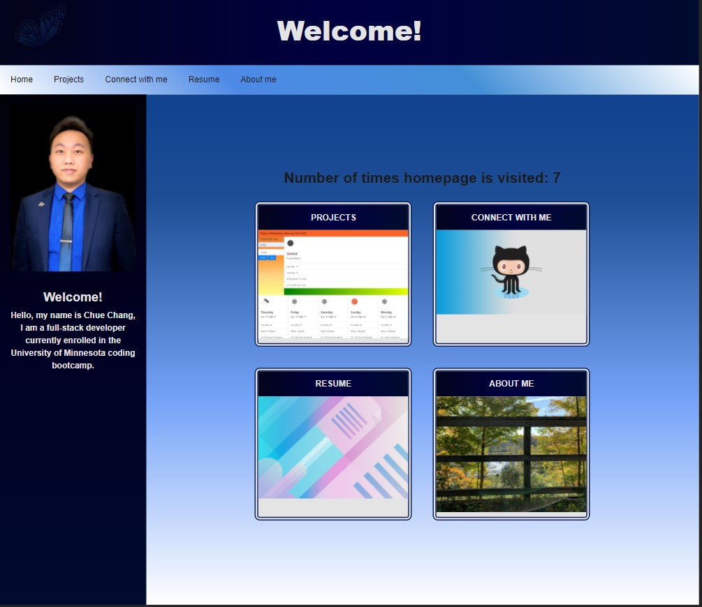

# 💎My Portfolio 2022💎
  
[Live-link to Heroku]()  

## 📝 Table of Content
*[Introduction](#introduction)  
*[Installation](#installation)  
*[Usage](#usage)  
*[Contribution](#contribution)  
*[Test](#test)  
*[Question](#question)  
*[License](#license)  
## Introduction: 
Hello, welcome to my portfolio readme. This is a website of my portfolio for the year of 2022. It is a simple website showcasing my skill and my projects.   
## 🛠️ Installation required:
In this web application, following packages are required; 
    `"dotenv": "^8.2.0",`  
    `"express": "^4.17.1",`  
    `"express-handlebars": "^5.2.0",`  
    `"express-session": "^1.17.1",`  
    `"handlebars": "^4.7.6",`  
    `"mysql2": "^2.2.5",`  
    `"sequelize": "^6.3.5"`  
## How to use this application:
It is an easy-to-use application and User can use application through web browser. The main purpose of this web application showcasing. 
## Contribution:
No contribution on this project.  
## Test
Everything is functioning without any errors. 
## Question
If there is any questions, free feel to reach out to me through github or email.  
📧 Email: <chuechang.full.stack.developer@gmail.com>  
📂 Github: <https://github.com/luckylobster25>  
## License
THE SOFTWARE IS PROVIDED "AS IS" AND THE AUTHOR DISCLAIMS ALL WARRANTIES WITH REGARD TO THIS SOFTWARE INCLUDING ALL IMPLIED WARRANTIES OF MERCHANTABILITY AND FITNESS. IN NO EVENT SHALL THE AUTHOR BE LIABLE FOR ANY SPECIAL, DIRECT, INDIRECT, OR CONSEQUENTIAL DAMAGES OR ANY DAMAGES WHATSOEVER RESULTING FROM LOSS OF USE, DATA OR PROFITS, WHETHER IN AN ACTION OF CONTRACT, NEGLIGENCE OR OTHER TORTIOUS ACTION, ARISING OUT OF OR IN CONNECTION WITH THE USE OR PERFORMANCE OF THIS SOFTWARE.  
